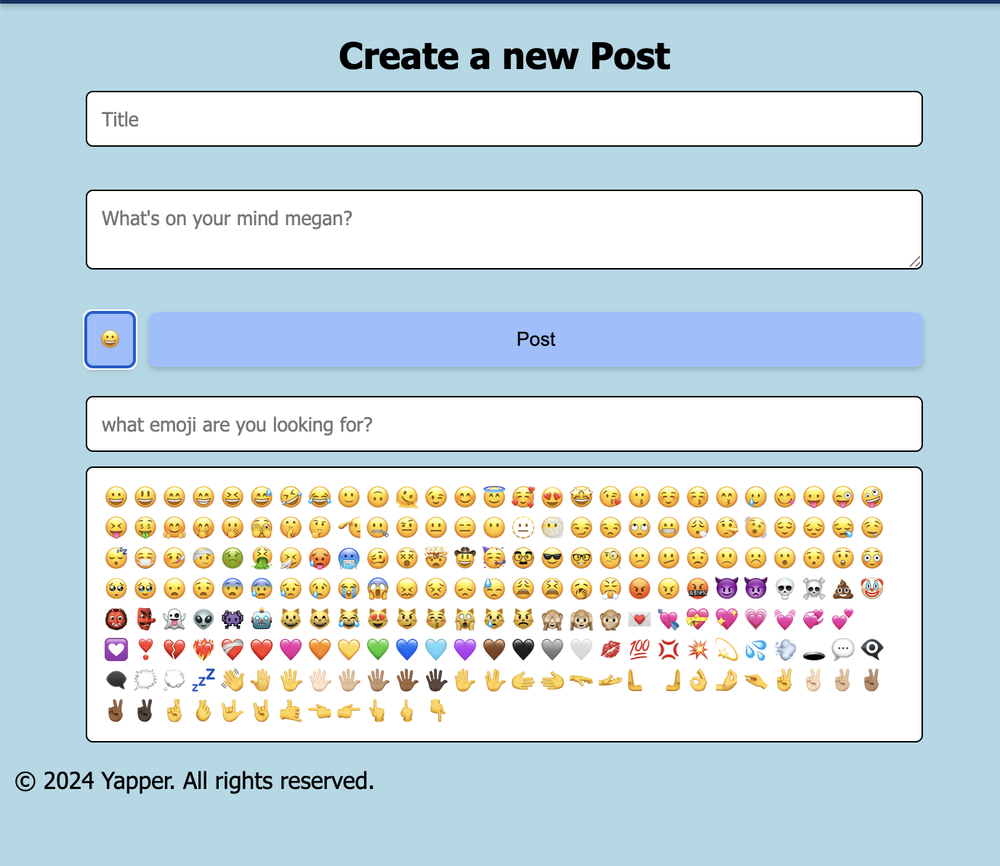

>**ECS 162 CA 3 Final MicroBlog Documentation**

**Home (not logged in)**  

- There is a drop-down option for the user to choose to sort by ‘most recent’ or ‘most liked’  
  - Based on which option is selected, the posts will sort themselves based on the selection  
- Shows title and context of the post as well as when it was posted and by whom  
- Also display the number of likes  
- If the user attempts to ‘reply’ and ‘post reply’ they will be redirected to the LOGIN/REGISTER page

**Login/Register**  

*Login with Google OAuth*

- The website will first prompt the user to sign in with Google

![][image3]  

![][image4]

- If the user has not signed in with that google account before, they will be prompted to register and create a new username  
  - If the username has already been taken, the user will be prompted to create a new one

- After doing so, page will be redirected to the home page  
- If the user has already registered an account with the blog, then they will be redirected to the home page

**Home (logged in)**  

***Left Side**:* place where user can submit a post  

- Allows input for Title and Content  
- **Emoji button:** shows the first 200 emojis of a list  
  - Also has a ‘search emoji’ feature where user can search for the emoji based on the name  
    - By clicking on the selected emoji, it will appear in the ‘Content’ textbox  
- **Submit button:** submits the post into to the database  
  - Submits with the user, title, content and timestamp of submission  
  - Post will have at the bottom  “Posted by \<User\> at \<Timestamp”  
  -   
  - The post will now show up as the first post on the Right Side if ordered by ‘most recent’

***Right Side*****:** place where user can see all posts by other users  

- Allows user to **sort** by ‘most recent’ or ‘most liked’ posts  
- Most recent will be based on the timestamp  
- Most liked will be based on the number of likes

Sorted by most recent post:  	 
Sort by most liked:  

- **Like button:** user can interact with other posts from other users by clicking on the heart (which will turn red upon hovering); they cannot like their own post  
  - By liking the post, the number of likes will increment  
- **Delete button:** a user can only delete their own posts and no one else’s  
  - Delete the post by clicking on the trashcan icon (will turn read upon hovering)  
- **Edit button:** a user can only edit their own posts and no one else’s

- By clicking on the post to edit, a textbox will appear with the original post content allowing the user to append or edit any changes  
  - The ‘save edit’ button will appear instead of the ‘edit’ button  
    - By clicking, this will submit the changes to the database, change timestamp to when the edits were made, and change the words to “Edited by \<User\> at \<Timestamp”  
  - **Reply button**: a user can reply to their own post or any other user’s posts

- By clicking on the post to reply, a new textbox will appear for the user to enter their reply  
  - A ‘post reply’ button will replace the ‘reply button’  
    - By clicking, this will submit the reply to the database and link it to the original post  
      - The reply post will appear underneath the original post with  “Posted by \<User\> at \<Timestamp”  
      - The user cannot edit a reply post

**Profile**  

- Has the avatar nice and large along with user data (username and when they became a user)  
- Lists the users posts below  
- User is also able to edit, delete, and reply in the PROFILE page  
  - In doing so it will redirect to HOME page

**Logout** 

- By clicking on the ‘logout’ on the navigation bar, it will log the user completely out of Google  
- For a split second, a ‘logging out of the account’ screen will pop up and then immediately redirect user to the HOME (NOT LOGGED IN) page

**Database**

- Getting the users from the database works.  
- Getting the posts from the database works.  
- Adding posts adds them to the database.   
- Adding/registering users adds them to the database.   
- Liking accurately updates the like count with the post in the database.  
- Deleting accurately deletes the post from the database.  
- Functions were updated to find users and posts from the database.   
- Information about posts and users persists after the server stops running and is populated the next time the server starts again.

**Client Variables**

- Used a .env and dotenv module to process the client id and secret

**Sorting Posts**

- Added a select element to the HTML so that the user can select which way to sort the posts.  
- The default view/order of the posts is by timestamp  
- The select has a listener attached that when the select option is changed from the dropdown menu, it calls the handler that passes in the option as a query to the home GET route.  
- The home GET route then processes the option choice from the query and gets the post in the chosen sorted order.  
- The posts are then rendered on the home page.